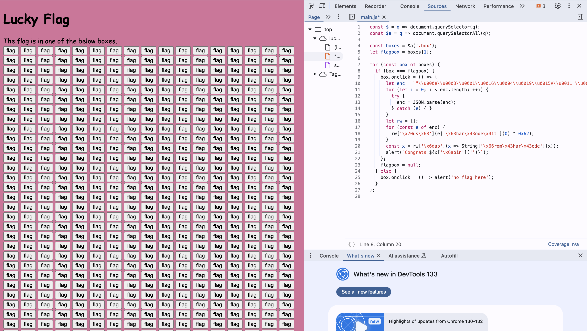

# LA-CTF-2025

## welcome

### welcome/rules

Navigate to the Rules section

flag: **lactf{my_entire_team_agrees_to_follow_the_rules}**

### welcome/discord

the flag is pinned in the #general channel on the LA CTF 2025 Discord server

flag: **lactf{i_l0v3_3d1t1ng_my_d1sc0rd_msgs}**

## Web

### web/lucky-flag



#### Decryption Process

```js
let enc = "\u000e\u0003\u0001\u0016\u0004\u0019\u0015V\u0011=\u000bU=\u000e\u0017\u0001\t=R\u0010=\u0011\t\u000bSS\u001f";
let rw = [];
for (const e of enc) {
  rw.push(e.charCodeAt(0) ^ 0x62);
}
const decrypted = rw.map(x => String.fromCharCode(x)).join('');
console.log(decrypted);
```

flag: **lactf{w4s_i7_luck_0r_ski11}**

## Crypto

### crypto/big e

```python
# Re-import necessary modules after execution state reset
from Crypto.Util.number import long_to_bytes, inverse, GCD, getPrime, bytes_to_long

# Reassign given values from chall.py
ct_1 = 7003427993343973209633604223157797389179484683813683779456722118278438552981580821629201099609635249903171901413187274301782131604125932440261436398792561279923201353644665062240232628983398769617870021735462687213315384230009597811708620803976743966567909514341685037497925118142192131350408768935124431331080433697691313467918865993755818981120044023483948250730200785386337033076398494691789842346973681951019033860698847693411061368646250415931744527789768875833220281187219666909459057523372182679170829387933194504283746668835390769531217602348382915358689492117524129757929202594190396696326156951763154356777
ct_2 = 2995334251818636287120912468673386461522795145344535560487265325864722413686091982727438605788851631192187299910519824438553287094479216297828199976116043039048528458879462591368580247044838727287694258607151549844079706204392479194688578102781851646467977751150658542264776551648799517340378173131694653270749425410071080383488918100565955153958793977478719703463115004497213753735577027928062856483316183232075922059366731900291340025009516177568909257605255717594938087543899066756942042664781424833498278544829618874970165660669400140113047048269742309745649848573501494088032718459018143817236079173978684104782
e_1 = 49043
e_2 = 60737
n = 9162219874876832806204248523866163938680921861751582550947065673035037752546476053774362284605943422397285024205866696280912237827227700515353007344062472274717294484810421409217463791112287997964358655519896402380272695026012981743782564008035342746214988154836484419372449523768063368280069515180570625408254410932129769708259508451185553774810385066789146531683973766796965747310893648672657945403825359068647151094841570404979930542270681833162424933411724266687320976217446032292107871449464575533610369244978941764470549091443086646932177141081314452355708815370388814214178980532690792441231698974328523197187

# Extended Euclidean Algorithm to find a, b such that a * e_1 + b * e_2 = 1
def extended_gcd(a, b):
    if b == 0:
        return a, 1, 0
    g, x1, y1 = extended_gcd(b, a % b)
    x = y1
    y = x1 - (a // b) * y1
    return g, x, y

g, a, b = extended_gcd(e_1, e_2)

# Ensure a and b are correct for modular exponentiation
if a < 0:
    ct_1 = inverse(ct_1, n)
    a = -a
if b < 0:
    ct_2 = inverse(ct_2, n)
    b = -b

# Compute the plaintext
pt = pow(ct_1, a, n) * pow(ct_2, b, n) % n

# Convert back to bytes
flag = long_to_bytes(pt)
flag

```

flag: **lactf{b1g_3_but_sm4ll_d!!!_part2_since_i_trolled}**

### crypto/Extremely Convenient Breaker

```python
import socket
import re

# Challenge server details
HOST = "chall.lac.tf"
PORT = 31180

# Function to connect and receive initial data
def connect_to_server():
    s = socket.socket(socket.AF_INET, socket.SOCK_STREAM)
    s.connect((HOST, PORT))
    data = s.recv(4096).decode()

    # Extract encrypted flag using regex
    match = re.search(r"Here's the encrypted flag in hex:\s*([\da-f]+)", data)
    if not match:
        print("[-] Failed to retrieve the encrypted flag!")
        s.close()
        return None, None

    encrypted_flag = match.group(1)
    print(f"[+] Encrypted Flag: {encrypted_flag}")

    return s, encrypted_flag

# Function to send ciphertext and get decrypted response
def query_oracle(s, ciphertext):
    s.sendall(ciphertext.encode() + b"\n")
    response = s.recv(4096).decode()
    return response.strip()

# Connect and retrieve encrypted flag
s, enc_flag_hex = connect_to_server()
if s is None:
    exit()

# Split encrypted flag into 16-byte (32 hex char) blocks
enc_blocks = [enc_flag_hex[i:i+32] for i in range(0, len(enc_flag_hex), 32)]

# Decrypt each block by submitting it 4 times
plaintext_blocks = []
for i, block in enumerate(enc_blocks):
    modified_ciphertext = block * 4  # Repeat block 4 times
    response = query_oracle(s, modified_ciphertext)
    print(f"Decrypted Block {i+1}: {response}")
    plaintext_blocks.append(response)

# Close the connection
s.close()

# Reassemble the flag
flag = "".join(plaintext_blocks)
print(f"[+] Recovered Flag: {flag}")
```

flag: **lactf{seems_it_was_extremely_convenient_to_get_the_flag_too_heh}**

### crypto/RSAaaS

Tired of doing RSA on your own? Try out my new service!

nc chall.lac.tf 31176

```python
from sympy import nextprime, gcd

e = 65537

# Start with a valid large prime
p = nextprime(2**63)
q = nextprime(p + 100000)  # Pick another nearby prime

phi = (p - 1) * (q - 1)

# Ensure gcd(phi, e) ≠ 1
while gcd(phi, e) == 1:
    q = nextprime(q + 100000)  # Keep adjusting q
    phi = (p - 1) * (q - 1)

print(f"p = {p}, q = {q}")
print(f"gcd(phi, e) = {gcd(phi, e)} (Should NOT be 1)")
```

flag: **lactf{actually_though_whens_the_last_time_someone_checked_for_that}**

## misc

### misc/extended

flag: **lactf{Funnily_Enough_This_Looks_Different_On_Mac_And_Windows}**

## rev

### rev/javascryption

```js
const msg = document.getElementById("msg");
const flagInp = document.getElementById("flag");
const checkBtn = document.getElementById("check");

function checkFlag(flag) {
    const step1 = btoa(flag);
    const step2 = step1.split("").reverse().join("");
    const step3 = step2.replaceAll("Z", "[OLD_DATA]");
    const step4 = encodeURIComponent(step3);
    const step5 = btoa(step4);
    return step5 === "JTNEJTNEUWZsSlglNUJPTERfREFUQSU1RG85MWNzeFdZMzlWZXNwbmVwSjMlNUJPTERfREFUQSU1RGY5bWI3JTVCT0xEX0RBVEElNURHZGpGR2I=";
}

checkBtn.addEventListener("click", () => {
    const flag = flagInp.value.toLowerCase();
    if (checkFlag(flag)) {
        flagInp.remove();
        checkBtn.remove();
        msg.innerText = flag;
        msg.classList.add("correct");
    } else {
        checkBtn.classList.remove("shake");
        checkBtn.offsetHeight;
        checkBtn.classList.add("shake");
    }
});
```

#### Reversing the Process

To recover the original flag, we need to:

1. Decode the stored Base64 string.
2. Decode the URL-encoded content.
3. Replace "[OLD_DATA]" back to "Z".
4. Reverse the string back.
5. Decode from Base64.

```js
import base64
import urllib.parse

# Encoded final check value from JavaScript
encoded_final = "JTNEJTNEUWZsSlglNUJPTERfREFUQSU1RG85MWNzeFdZMzlWZXNwbmVwSjMlNUJPTERfREFUQSU1RGY5bWI3JTVCT0xEX0RBVEElNURHZGpGR2I="

# Step 1: Base64 decode
decoded_step4 = base64.b64decode(encoded_final).decode()

# Step 2: URL decode
decoded_step3 = urllib.parse.unquote(decoded_step4)

# Step 3: Replace "[OLD_DATA]" back to "Z"
decoded_step2 = decoded_step3.replace("[OLD_DATA]", "Z")

# Step 4: Reverse the string
decoded_step1 = decoded_step2[::-1]

# Step 5: Base64 decode to get the original flag
original_flag = base64.b64decode(decoded_step1).decode()

# Output the recovered flag
original_flag
```

flag: **lactf{no_grizzly_walls_here}**
