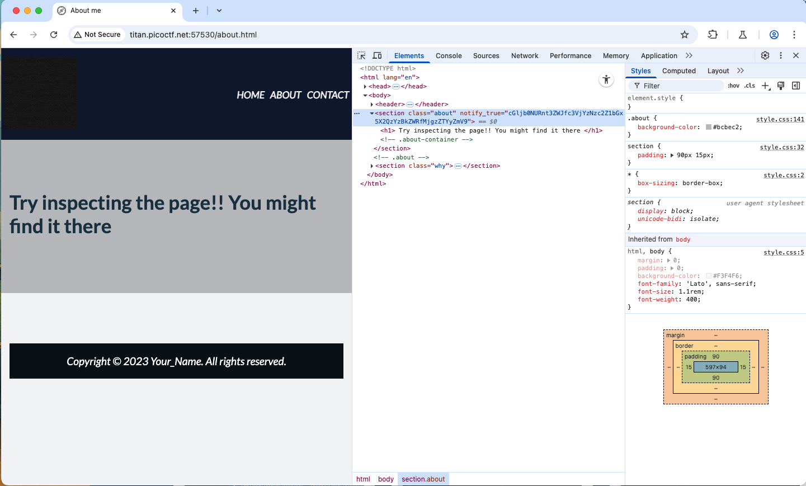
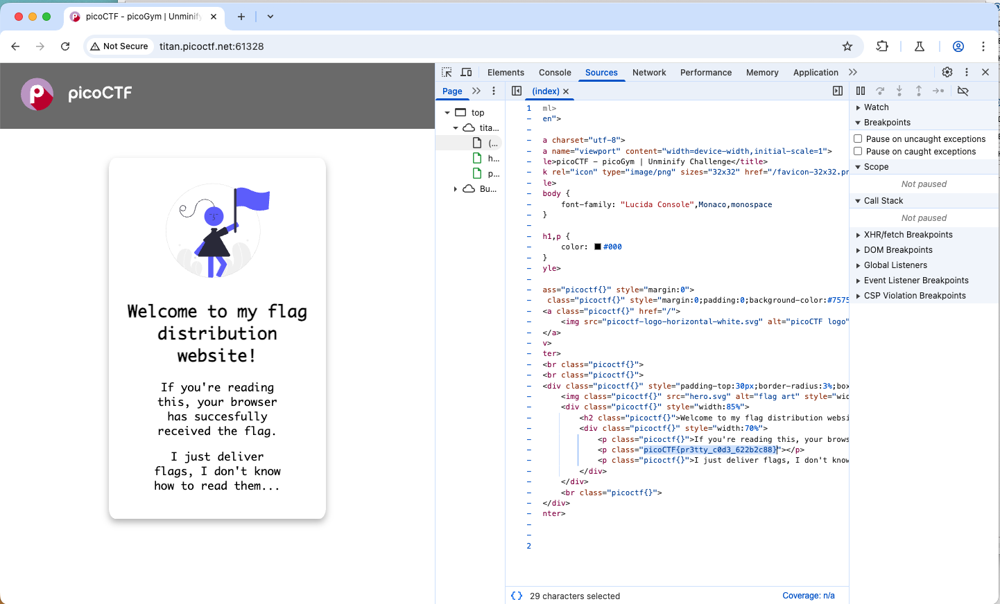

# PicoCTF

## Note

### encoding hint

- Characters are only A–Z a–z and spaces/punctuation, and text looks like garbled English → try ROT13 / Caesar (letter-substitution).
- Contains only hex digits 0-9a-f (maybe even length) → hex (ASCII hex).
- Contains A–Z a–z 0–9 + / and maybe ending = → Base64.
- Has lots of % signs and hex pairs like %20 → URL encoding.
- Starts with & and ends with ; like &lt; → HTML entities.
- Looks long and random binary when saved → could be compressed/encoded (gzip, uuencode) — use file or strings.
- Contains only digits and commas or looks numeric → maybe simple substitution or numeric codes.

using <https://gchq.github.io/CyberChef>

## Web Exploitation

### Easy

#### Crack the Gate 1

AUTHOR: YAHAYA MEDDY

Description

We’re in the middle of an investigation. One of our persons of interest, ctf player, is believed to be hiding sensitive data inside a restricted web portal. We’ve uncovered the email address he uses to log in: <ctf-player@picoctf.org>. Unfortunately, we don’t know the password, and the usual guessing techniques haven’t worked. But something feels off... it’s almost like the developer left a secret way in. Can you figure it out?
The website is running here. Can you try to log in?

**hint:**

- Developers sometimes leave notes in the code; but not always in plain text.
- A common trick is to rotate each letter by 13 positions in the alphabet.

**Solution:**

there is a comment in the source: ```<!-- ABGR: Wnpx - grzcbenel olcnff: hfr urnqre "K-Qri-Npprff: lrf" -->```

the comment is encode by ROT13 then decode it, ```NOTE: Jack - temporary bypass: use header "X-Dev-Access: yes"```

```sh
curl -s -X POST "<http://amiable-citadel.picoctf.net:49652/login>" \
  -H "Content-Type: application/json" \
  -H "X-Dev-Access: yes" \
  -d '{"email":"<ctf-player@picoctf.org>","password":"anything"}' | jq -r .flag
```

**flag:** ```picoCTF{brut4_f0rc4_1a386e6f}```

#### SSTI1

AUTHOR: VENAX

Description

I made a cool website where you can announce whatever you want! Try it out!

Additional details will be available after launching your challenge instance.

**hint:**

- Server Side Template Injection

**Solution:**

- confirm that the server is Jinja2 by using ```{{7*7}}```
- using ```{{ url_for.**globals**['**builtins**']['open']('flag').read() }}``` (Use common Flask globals (often present)) and submi

**flag:** ```picoCTF{s4rv3r_s1d3_t3mp14t3_1nj3ct10n5_4r3_c001_bdc95c1a}```

#### Cookie Monster Secret Recipe

AUTHOR: BRHANE GIDAY AND PRINCE NIYONSHUTI N.

Description

Cookie Monster has hidden his top-secret cookie recipe somewhere on his website. As an aspiring cookie detective, your mission is to uncover this delectable secret. Can you outsmart Cookie Monster and find the hidden recipe?

Additional details will be available after launching your challenge instance.

**hint:**

- Sometimes, the most important information is hidden in plain sight. Have you checked all parts of the webpage?
- Cookies aren't just for eating - they're also used in web technologies!
- Web browsers often have tools that can help you inspect various aspects of a webpage, including things you can't see directly.

**Solution:**


**flag:** ```picoCTF{c00k1e_m0nster_l0ves_c00kies_2C8040EF}```

#### WebDecode

AUTHOR: NANA AMA ATOMBO-SACKEY

Description

Do you know how to use the web inspector?

Additional details will be available after launching your challenge instance.

**hint:**

- Use the web inspector on other files included by the web page.
- The flag may or may not be encoded

**Solution:**



it was encoded by base64.

**flag:** ```picoCTF{web_succ3ssfully_d3c0ded_283e62fe}```

#### Unminify

AUTHOR: JEFFERY JOHN

Description

I don't like scrolling down to read the code of my website, so I've squished it. As a bonus, my pages load faster!

Additional details will be available after launching your challenge instance.

**hint:**

- Try CTRL+U / ⌘+U in your browser to view the page source. You can also add 'view-source:' before the URL, or try `curl <URL>`in your shell.
- Minification reduces the size of code, but does not change its functionality.
- What tools do developers use when working on a website? Many text editors and browsers include formatting.

**Solution:**



**flag:** ```picoCTF{pr3tty_c0d3_622b2c88}```
