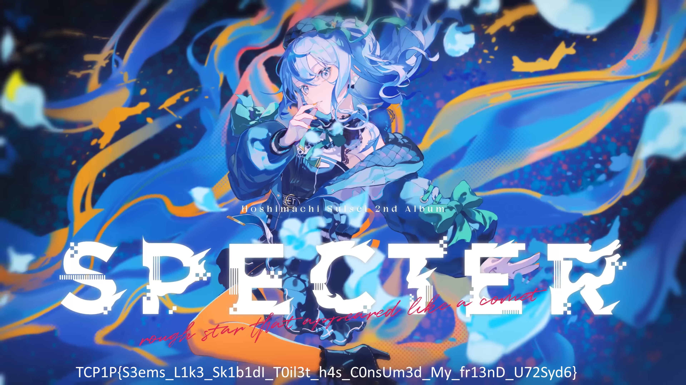

# Skibidi Format

## Metadata

- Event: TCP1P 2024
- Category: Forensics
- Difficulty: Unknown
- Status: Solved
- Main Writeup: [main.ipynb](main.ipynb)
- Files: [main.ipynb](main.ipynb), [dist/spec.html](dist/spec.html), [dist/suisei.skibidi](dist/suisei.skibidi), [output_image.png](output_image.png)
- Skills Learned: Reading a custom file format, AES-GCM decryption, Zstandard decompression, image reconstruction

Open the File:

```python
with open('./dist/suisei.skibidi', 'rb') as file:
    data = file.read()
```

```python
# Reading the first 58 bytes (header)
header = data[:58]
magic_number = header[:4].decode()  # SKB1
width = int.from_bytes(header[4:8], 'little')  # Image width
height = int.from_bytes(header[8:12], 'little')  # Image height
color_channels = header[12]  # Number of color channels
compression_method = header[13]  # Compression method (1 for Zstandard)
aes_key = header[14:46]  # AES-256 Key (32 bytes)
aes_iv = header[46:58]  # AES IV (12 bytes)
```

```python
from Crypto.Cipher import AES

# Create AES-GCM cipher object
cipher = AES.new(aes_key, AES.MODE_GCM, nonce=aes_iv)

# Decrypt the encrypted data (everything after the header)
encrypted_data = data[58:]
decrypted_data = cipher.decrypt(encrypted_data)
```

```python
import zstandard as zstd

channels = 4
decompressed_size = width * height * channels  # Example for image size
decompressor = zstd.ZstdDecompressor()
pixel_data = decompressor.decompress(decrypted_data, decompressed_size)
```

```python
from PIL import Image
import numpy as np

# Reshape pixel data based on width, height, and channels
pixel_array = np.frombuffer(pixel_data, dtype=np.uint8)
pixel_array = pixel_array.reshape((height, width, color_channels))

# Create an image object
img = Image.fromarray(pixel_array)

# Save or display the image
img.save('output_image.png')
img.show()
```




TCP1P{S3ems_L1k3_Sk1b1dI_T0il3t_h4s_C0nsUm3d_My_fr13nD_U72Syd6}
