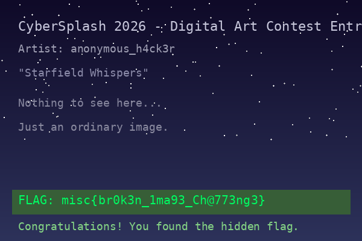

# Image Repair

## Metadata

- Event: Cybersplash 2026
- Category: Misc
- Difficulty: Unknown
- Status: Solved
- Files: [broken-image.png](broken-image.png), [damaged_qr.png](damaged_qr.png), [landscape.jpg](landscape.jpg)
- Skills Learned: Image forensics

## Problem Summary

Three image files, each with a different hiding technique: appended data in a JPEG, a tampered PNG header, and a damaged QR code.

## What I Tried

1. `file broken-image.png damaged_qr.png landscape.jpg`

    ```txt
    broken-image.png: PNG image data, 600 x 250, 8-bit/color RGBA, non-interlaced
    damaged_qr.png:   PNG image data, 370 x 370, 8-bit/color RGB, non-interlaced
    landscape.jpg:    JPEG image data, baseline, precision 8, 800x600, components 3
    ```

2. `exiftool broken-image.png damaged_qr.png landscape.jpg`

    ```txt
      ======== broken-image.png
      ExifTool Version Number         : 13.55
      File Name                       : broken-image.png
      Directory                       : .
      File Size                       : 34 kB
      File Modification Date/Time     : 2026:04:04 22:59:05+07:00
      File Access Date/Time           : 2026:07:29 15:18:06+07:00
      File Inode Change Date/Time     : 2026:07:29 15:18:05+07:00
      File Permissions                : -rw-r--r--
      File Type                       : PNG
      File Type Extension             : png
      MIME Type                       : image/png
      Image Width                     : 600
      Image Height                    : 250
      Bit Depth                       : 8
      Color Type                      : RGB with Alpha
      Compression                     : Deflate/Inflate
      Filter                          : Adaptive
      Interlace                       : Noninterlaced
      Image Size                      : 600x250
      Megapixels                      : 0.150
      ======== damaged_qr.png
      ExifTool Version Number         : 13.55
      File Name                       : damaged_qr.png
      Directory                       : .
      File Size                       : 2.1 kB
      File Modification Date/Time     : 2026:04:05 00:21:29+07:00
      File Access Date/Time           : 2026:07:29 15:26:50+07:00
      File Inode Change Date/Time     : 2026:07:29 15:18:05+07:00
      File Permissions                : -rw-r--r--
      File Type                       : PNG
      File Type Extension             : png
      MIME Type                       : image/png
      Image Width                     : 370
      Image Height                    : 370
      Bit Depth                       : 8
      Color Type                      : RGB
      Compression                     : Deflate/Inflate
      Filter                          : Adaptive
      Interlace                       : Noninterlaced
      Image Size                      : 370x370
      Megapixels                      : 0.137
      ======== landscape.jpg
      ExifTool Version Number         : 13.55
      File Name                       : landscape.jpg
      Directory                       : .
      File Size                       : 26 kB
      File Modification Date/Time     : 2026:04:05 00:06:38+07:00
      File Access Date/Time           : 2026:07:29 15:28:25+07:00
      File Inode Change Date/Time     : 2026:07:29 15:18:05+07:00
      File Permissions                : -rw-r--r--
      File Type                       : JPEG
      File Type Extension             : jpg
      MIME Type                       : image/jpeg
      Comment                         : The real secret is hiding after the end...
      JFIF Version                    : 1.01
      Resolution Unit                 : None
      X Resolution                    : 1
      Y Resolution                    : 1
      Image Width                     : 800
      Image Height                    : 600
      Encoding Process                : Baseline DCT, Huffman coding
      Bits Per Sample                 : 8
    ```

    The highlight is **"The real secret is hiding after the end..."** in the `landscape.jpg` comment field.

3. `xxd landscape.jpg | tail -20`

    ```txt
    00006610: a4cd 19a0 2c2d 1499 a334 0585 a293 3466  ....,-...4....4f
    00006620: 80b0 b452 668c d016 168a 4cd1 9a02 c2d1  ...Rf.....L.....
    00006630: 499a 3340 584a 28a2 8282 8a28 a002 8a28  I.3@XJ(....(...(
    00006640: a002 8a28 a002 8a28 a002 8a28 a002 8a28  ...(...(...(...(
    00006650: a002 8a28 a002 8a28 a002 8a28 a002 8a28  ...(...(...(...(
    00006660: a002 8a28 a002 8a28 a002 8a28 a002 8a28  ...(...(...(...(
    00006670: a002 8a28 a002 8a28 a002 8a28 a002 8a28  ...(...(...(...(
    00006680: a002 8a28 a002 8a28 a002 8a28 a002 8a28  ...(...(...(...(
    00006690: a002 8a28 a002 8a28 a002 8a28 a002 8a28  ...(...(...(...(
    000066a0: a002 8a28 a002 8a28 a002 8a28 a002 8a28  ...(...(...(...(
    000066b0: a002 8a28 a002 8a28 a002 8a28 a002 8a28  ...(...(...(...(
    000066c0: a002 8a28 a002 8a28 a002 8a28 a002 8a28  ...(...(...(...(
    000066d0: a002 8a28 a002 8a28 a002 8a28 a002 8a28  ...(...(...(...(
    000066e0: a002 8a28 a002 8a28 a002 8a28 a002 8a28  ...(...(...(...(
    000066f0: a002 8a28 a002 8a28 a002 8a28 a00f ffd9  ...(...(...(....
    00006700: 0a0a 2d2d 2d20 4849 4444 454e 2044 4154  ..--- HIDDEN DAT
    00006710: 4120 2d2d 2d0a 6d69 7363 7b6d 3173 735f  A ---.misc{m1ss_
    00006720: 6330 7272 7570 375f 316d 4139 337d 0a2d  c0rrup7_1mA93}.-
    00006730: 2d2d 2045 4e44 2048 4944 4445 4e20 4441  -- END HIDDEN DA
    00006740: 5441 202d 2d2d 0a                        TA ---.`
    ```

    flag: `misc{m1ss_c0rrup7_1mA93}`

4. for broken-image.png,
    - check the PNG chunk structure: `python inspect_chunks.py`

        ```txt
        PNG signature: 89504e470d0a1a0a

        Chunk: IHDR, Length: 13
        Chunk: IDAT, Length: 33860
        Chunk: IEND, Length: 0
        ```

    - check dimensions: `python check_dimensions.py`

        ```txt
        Decompressed IDAT size: 960400 bytes

        Declared dimensions: 600x250, expected: 600250 bytes
        Actual height if width=600: 400.0 rows
        ```

        that means IHDR height tampered (250→400) to hide pixel rows

    - repair image: `python repair_png.py`

        

        flag: `misc{br0k3n_1ma93_Ch@773ng3}`

5. for damaged_qr.png
    - scan it and got: `misc{R3pa1r_M3_P73@s3}`

## Key Idea

- `landscape.jpg`: data appended after JPEG end marker (`FF D9`)
- `broken-image.png`: IHDR height tampered (250→400) to hide pixel rows
- `damaged_qr.png`: QR error correction handles up to 30% damage — scan before repairing

## Solution Walkthrough

1. Run `exiftool` on all files — spot the hidden comment in `landscape.jpg`
2. Run `xxd landscape.jpg | tail -20` — find data after the `FF D9` JPEG end marker
3. Inspect PNG chunks and decompress IDAT — detect size mismatch revealing hidden rows
4. Patch IHDR height from 250 to 400, fix CRC, open repaired image
5. Scan `damaged_qr.png` directly — error correction recovers the flag without manual repair

## Flag

- `misc{m1ss_c0rrup7_1mA93}` (landscape.jpg)
- `misc{br0k3n_1ma93_Ch@773ng3}` (broken-image.png)
- `misc{R3pa1r_M3_P73@s3}` (damaged_qr.png)

## Lessons Learned

- Check data after JPEG `FF D9` end marker when exiftool hints at hidden content
- Verify PNG declared dimensions against decompressed IDAT size to detect tampering
- Try scanning a damaged QR code before attempting manual repair — error correction may be enough
